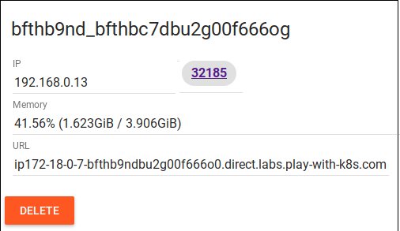

# Securing our pods.

## Deploying our application

```
cat <<EOF | kubectl apply -f -
apiVersion: apps/v1 # for versions before 1.9.0 use apps/v1beta2
kind: Deployment
metadata:
  name: webapp-deployment
spec:
  selector:
    matchLabels:
      app: webapp
  replicas: 1
  template:
    metadata:
      labels:
        app: webapp
    spec:
      containers:
      - name: webapp
        image: scottyc/webapp:latest
        ports:
        - containerPort: 3000
          hostPort: 3000
EOF        
```       
Then we expose the deployment   
`kubectl expose deployment webapp-deployment --type=LoadBalancer`  
### play with k8s
We should have a button pop up that will allow us to click through to our application.  
In the image below you can see mine has exposed `32185`  
  
### Minikube
To find the nodes port on minikube we will issue the command `minikube service list`
```
|-------------|----------------------|-----------------------------|
|  NAMESPACE  |         NAME         |             URL             |
|-------------|----------------------|-----------------------------|
| default     | kubernetes           | No node port                |
| default     | webapp-deployment    | http://172.16.146.152:30687 |
| kube-system | kube-dns             | No node port                |
| kube-system | kubernetes-dashboard | No node port                |
|-------------|----------------------|-----------------------------|
```

For me I can access the app at `http://172.16.146.152:30687`

## The hack
Now we have our application running, lets look at a few things.  
Firstly we will get our pod name `kubectl get pods` mine is `webapp-deployment-865fb4d7c-8c5sv`   
We will then exec into the running container  `kubectl exec -it webapp-deployment-865fb4d7c-8c5sv sh`  
The `cd static` and `vim index.html`  
replace the gif link in line 19 with `https://media.giphy.com/media/DBfYJqH5AokgM/giphy.gif`  

Now check your browser !!!

## Lets protect our app
Now we are going to look at setting some pod security  


### Change the user the application runs as
```
cat <<EOF | kubectl apply -f -
apiVersion: apps/v1 # for versions before 1.9.0 use apps/v1beta2
kind: Deployment
metadata:
  name: webapp-deployment
spec:
  selector:
    matchLabels:
      app: webapp
  replicas: 1
  template:
    metadata:
      labels:
        app: webapp
    spec:
      containers:
      - name: webapp
        image: scottyc/webapp:latest
        ports:
        - containerPort: 3000
          hostPort: 3000
        securityContext:
          runAsUser: 1000
EOF
```

### Read only file system
```
cat <<EOF | kubectl apply -f -
apiVersion: apps/v1 # for versions before 1.9.0 use apps/v1beta2
kind: Deployment
metadata:
  name: webapp-deployment
spec:
  selector:
    matchLabels:
      app: webapp
  replicas: 1
  template:
    metadata:
      labels:
        app: webapp
    spec:
      containers:
      - name: webapp
        image: scottyc/webapp:latest
        ports:
        - containerPort: 3000
          hostPort: 3000
        securityContext:
          readOnlyRootFilesystem: true
EOF
```
### Disable privilege escalation 
```
cat <<EOF | kubectl apply -f -
apiVersion: apps/v1 # for versions before 1.9.0 use apps/v1beta2
kind: Deployment
metadata:
  name: webapp-deployment
spec:
  selector:
    matchLabels:
      app: webapp
  replicas: 1
  template:
    metadata:
      labels:
        app: webapp
    spec:
      containers:
      - name: webapp
        image: scottyc/webapp:latest
        ports:
        - containerPort: 3000
          hostPort: 3000
        securityContext:
          allowPrivilegeEscalation: false
EOF
```

### All of them together
```
cat <<EOF | kubectl apply -f -
apiVersion: apps/v1 # for versions before 1.9.0 use apps/v1beta2
kind: Deployment
metadata:
  name: webapp-deployment
spec:
  selector:
    matchLabels:
      app: webapp
  replicas: 1
  template:
    metadata:
      labels:
        app: webapp
    spec:
      containers:
      - name: webapp
        image: scottyc/webapp:latest
        ports:
        - containerPort: 3000
          hostPort: 3000
        securityContext:
          runAsUser: 1000
          readOnlyRootFilesystem: true
          allowPrivilegeEscalation: false
EOF
```